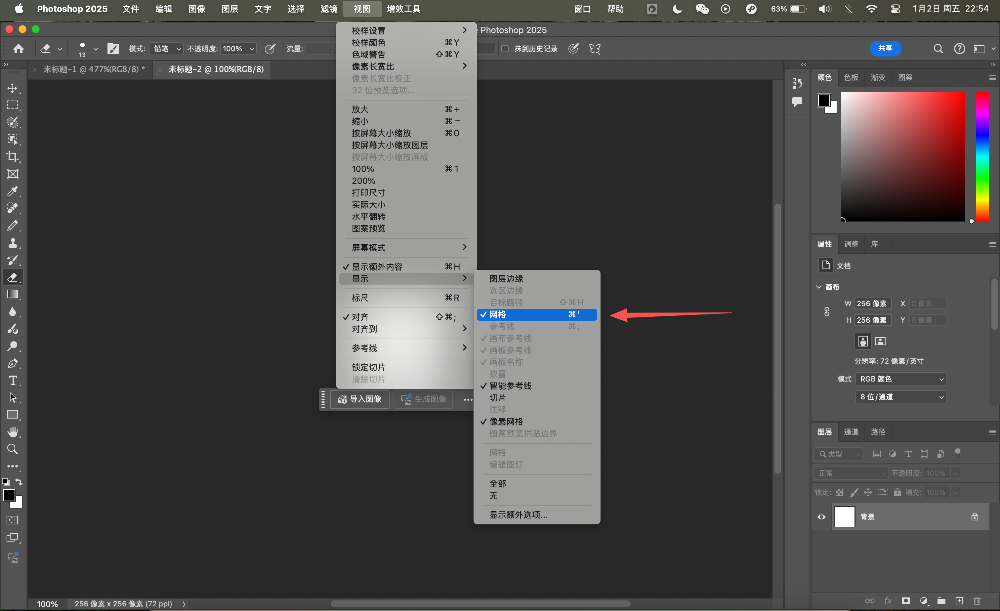
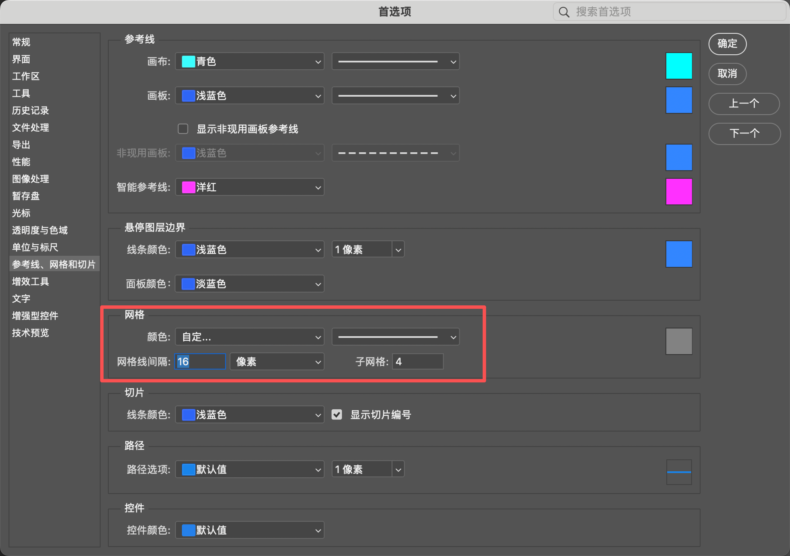

---

---

# 像素画入门工具介绍及使用指南

# 01. 工具介绍

**Photoshop (PS)**：适合已熟悉PS操作、偶尔尝试像素画的人群。可借助铅笔工具结合像素网格完成绘制，但缺乏像素动画专属功能，更适合静态像素画创作。

**Aseprite**：专为像素画与像素动画设计，功能聚焦且针对性强。内置洋葱皮、调色板管理、精灵表自动导出等核心功能，操作高效，是游戏美术设计与像素动画制作的优选工具。

以下分别为大家介绍两种工具的入门使用方法：

## 一、Photoshop (PS) 入门操作

1.新建文件：设置宽度与高度均为256像素（单位选择“像素”），分辨率设为72像素/英寸，颜色模式选择“RGB”、8位通道。

2.工具设置：像素画绘制需规避默认画笔，需右键切换工具：将画笔切换为「铅笔工具」，橡皮擦工具同样切换为「铅笔模式」（确保绘制边缘锐利，符合像素画质感）。

同样选择橡皮擦后，选择下图的模式为铅笔模式

3.网格辅助设置：打开网格可精准定位像素，操作路径：点击顶部菜单栏「视图」-「显示」-「网格」，或使用快捷键：Windows系统按**Ctrl + '**，Mac系统按**Command + '**。

4.网格参数调整：进入「编辑」-「首选项」-「参考线、网格和切片」（原文“参考下”修正），设置网格线间距为16像素（单位选择“像素”），辅助像素块精准排列。

PS的像素画基础操作核心在于工具与网格设置，后续更多技巧需结合实际练习逐步熟悉。下面重点介绍实操性更强、更适配像素创作的Aseprite工具。

## 二、Aseprite 入门操作

1. 新建像素项目：打开Aseprite后，点击顶部「File」-「New」（或快捷键Ctrl+N/Command+N），在弹窗中设置画布尺寸（新手推荐256×256像素，可根据需求调整），颜色模式默认RGB即可，点击「OK」完成创建。
2. 核心工具初识：左侧工具栏为常用绘制工具，核心工具包括「铅笔」（Pixel Pencil，快捷键P）、「橡皮擦」（Eraser，快捷键E）、「填充」（Bucket Fill，快捷键G），新手优先掌握这三个工具即可满足基础绘制需求。
3. 网格与像素对齐设置：点击顶部「View」-「Grid」（或快捷键Ctrl+G/Command+G）开启网格；再勾选「View」-「Snap to Grid」（吸附到网格），确保绘制的像素精准贴合网格，避免出现模糊边缘。
4. 调色板管理（核心功能）：右侧默认显示调色板面板，可直接选择预设颜色；若需自定义颜色，点击调色板空白处，在弹窗中设置RGB值或取色，点击「Add」添加到调色板，方便创作时统一色调。
5. 像素动画基础（洋葱皮功能）：若需制作简单动画，先点击底部「Frames」面板的「New Frame」（新建帧，快捷键Alt+N/Option+N）；再勾选顶部「View」-「Onion Skin」（洋葱皮模式），即可在当前帧看到前后帧的半透明叠加效果，便于衔接动画动作。
6. 作品导出：静态作品可通过「File」-「Export As」选择PNG格式导出；动画作品需导出为精灵表时，点击「File」-「Export Sprite Sheet」，在弹窗中设置导出参数（如排列方式、尺寸），点击「Export」即可自动生成精灵表，直接适配游戏开发使用。
