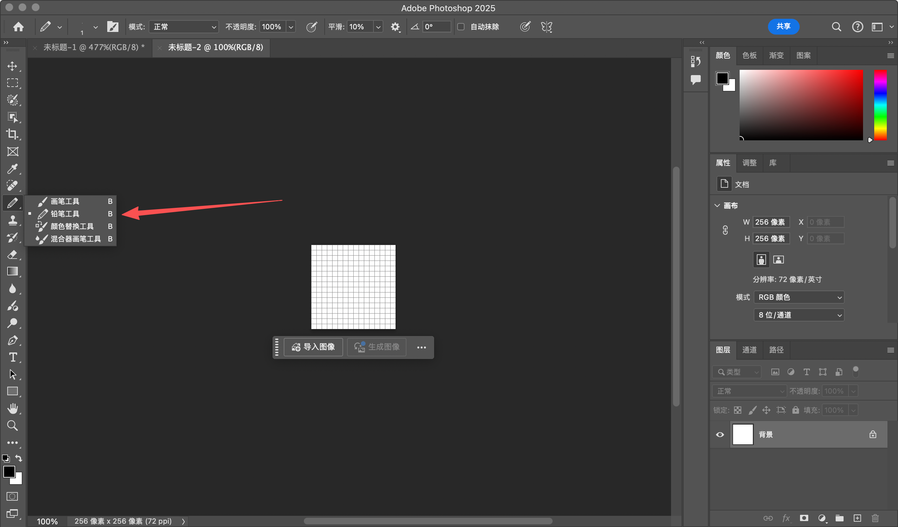
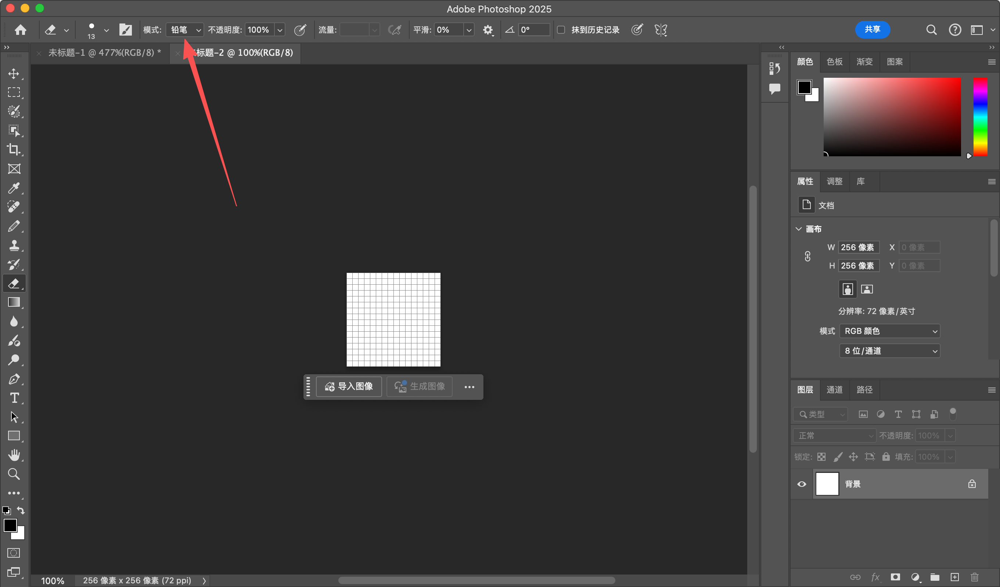
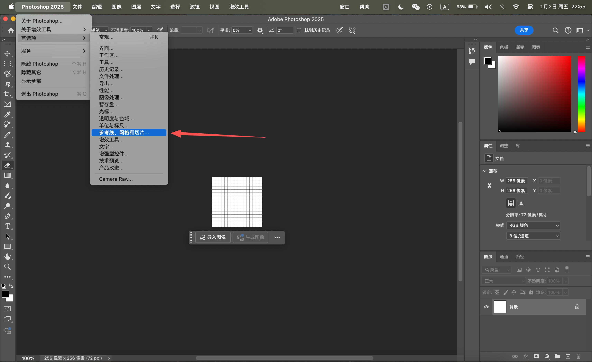
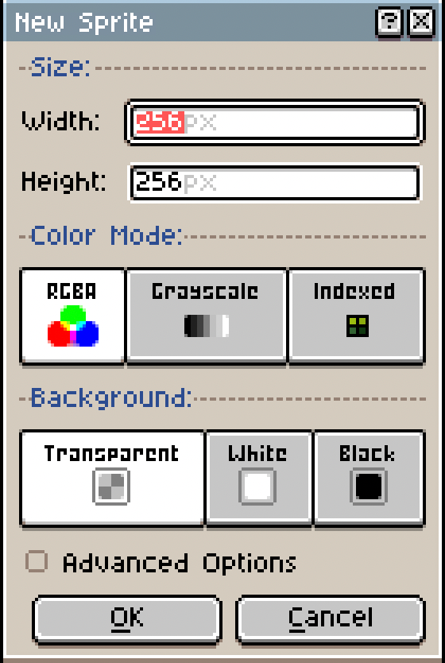
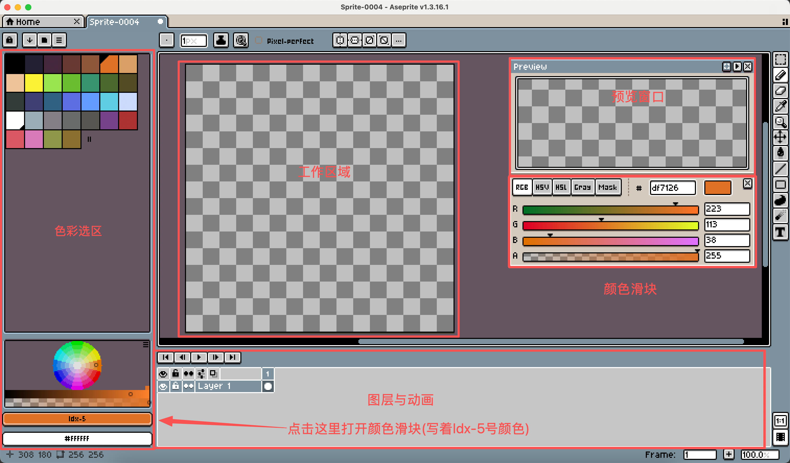
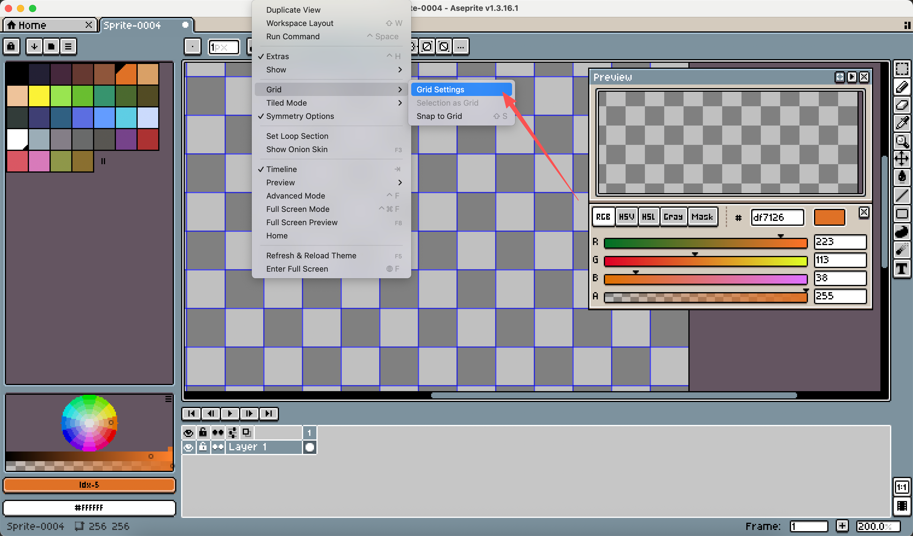
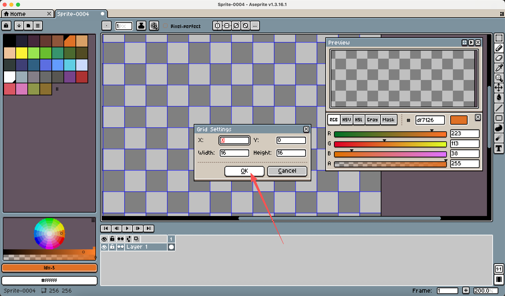
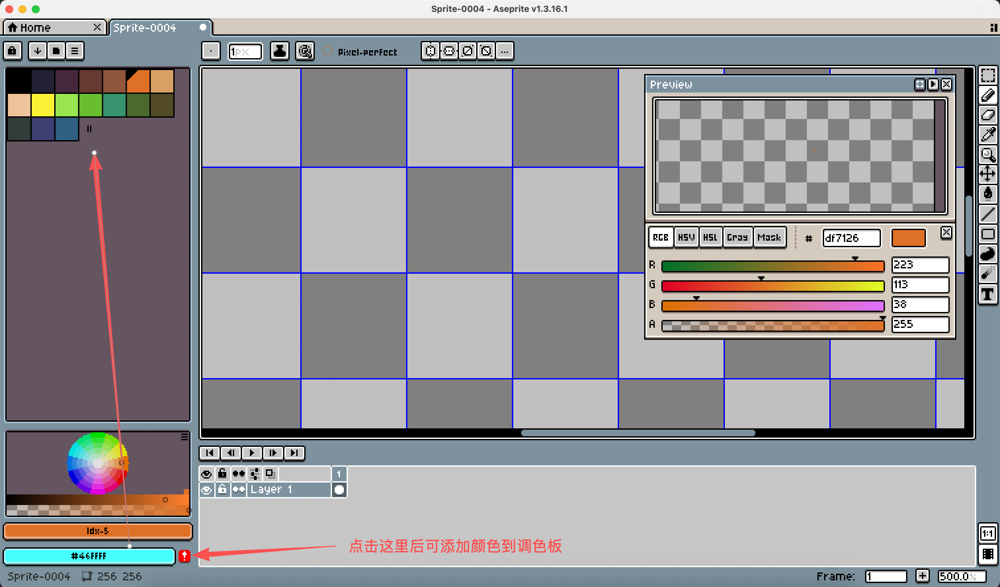
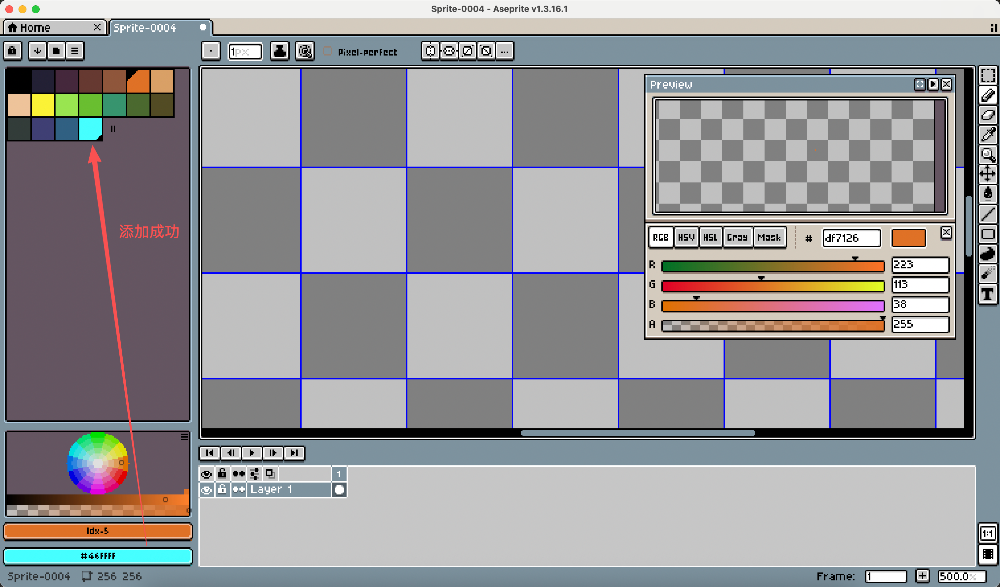

# 像素画入门工具介绍及使用指南

# 01. 工具介绍

**Photoshop (PS)**：适合已熟悉PS操作、偶尔尝试像素画的人群。可借助铅笔工具结合像素网格完成绘制，但缺乏像素动画专属功能，更适合静态像素画创作。

**Aseprite**：专为像素画与像素动画设计，功能聚焦且针对性强。内置洋葱皮、调色板管理、精灵表自动导出等核心功能，操作高效，是游戏美术设计与像素动画制作的优选工具。

以下分别为大家介绍两种工具的入门使用方法：

## 一、Photoshop (PS) 入门操作

1. 新建文件：设置宽度与高度均为256像素（单位选择“像素”），分辨率设为72像素/英寸，颜色模式选择“RGB”、8位通道。

2. 工具设置：像素画绘制需规避默认画笔，需右键切换工具：将画笔切换为「铅笔工具」，橡皮擦工具同样切换为「铅笔模式」（确保绘制边缘锐利，符合像素画质感）。

同样选择橡皮擦后，选择下图的模式为铅笔模式

3. 网格辅助设置：打开网格可精准定位像素，操作路径：点击顶部菜单栏「视图」-「显示」-「网格」，或使用快捷键：Windows系统按**Ctrl + '**，Mac系统按**Command + '**。

4. 网格参数调整：进入「编辑」-「首选项」-「参考线、网格和切片」（原文“参考下”修正），设置网格线间距为16像素（单位选择“像素”），辅助像素块精准排列。

PS的像素画基础操作核心在于工具与网格设置，后续更多技巧需结合实际练习逐步熟悉。下面重点介绍实操性更强、更适配像素创作的Aseprite工具。

## 二、Aseprite 入门操作

作为像素画专用工具，Aseprite的操作逻辑更贴合像素创作需求，新手可按“新建项目→布局适配→核心工具→辅助设置→调色管理”的流程快速上手，以下是详细步骤：

1. 新建像素项目：打开Aseprite后，点击顶部「File」-「New」（或快捷键Ctrl+N/Command+N）唤起新建窗口。新手推荐直接设置画布尺寸为256×256像素（后续可根据创作需求缩放调整），颜色模式保持默认（RGB），点击「OK」即可完成创建。

2. 界面布局适配（新手友好）：默认布局可能存在操作区域分散的问题，推荐调整为“预览窗口+工具面板+调色板”的紧凑布局，我个人常用的设置是：将颜色滑块移至预览窗口下方，方便取色时实时观察效果。调出颜色滑块的方法很简单：点击左侧调色板面板中的「Foreground Color」（显示“Idx-5”的色块，其中Idx-5代表调色盘第5号颜色，注意编号从0开始），即可弹出颜色调节面板。

3. 核心工具快速掌握：右侧工具栏集中了所有绘制所需工具，新手无需全部记忆，优先掌握5个核心工具即可覆盖基础创作，每个工具附快捷键方便高效操作：

- 「铅笔」（快捷键B）：核心绘制工具，点击即可在画布上绘制像素，边缘锐利，是像素画的主力工具；
- 「橡皮擦」（快捷键E）：删除多余像素，默认删除后显示透明背景，可根据需求切换；
- 「填充」（快捷键G）：快速填充大面积色块，点击目标区域即可填充当前选中的前景色，适合给图形上色；
- 「选区」（快捷键M）：精准选中特定像素区域，可用于批量移动、复制或修改像素；
- 「吸取」（快捷键I）：快速拾取画布上的颜色，点击目标颜色即可将其设为前景色，方便匹配已有色调。

4. 网格与像素对齐设置：精准定位像素是像素画的关键，Aseprite的网格设置步骤如下：点击顶部菜单栏「View」-「Grid」-「Grid Settings」，在弹出的窗口，可以调节网格的宽度高度，确认没问题后直接点击「OK」即可开启网格。

5. 调色板管理：统一的色调是像素画美观的关键，Aseprite的调色板功能可轻松实现色彩管理，操作分为“选用预设”和“自定义添加”两种：

- 选用预设颜色：左侧默认显示调色板面板，面板内包含多种基础预设颜色，点击即可选中作为当前前景色，直接用于绘制；
- 自定义添加颜色：若预设颜色无法满足需求，我们也可以自己添加颜色。点击「Add」按钮，即可将自定义颜色添加到调色板中。

以上就是Aseprite的基础入门操作。
